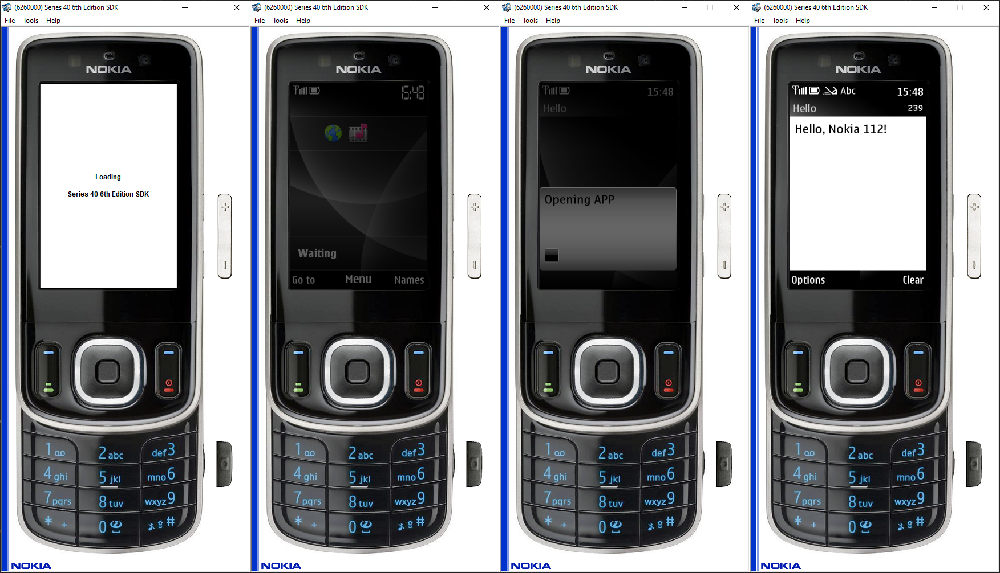

# 🖁 j2me-template

[](https://www.gnu.org/software/make/)  
[](https://en.wikipedia.org/wiki/Java_Platform,_Micro_Edition)  
[](https://opensource.org/licenses/MIT)

> A lightweight starter template for creating **Java ME (J2ME)** applications using **MIDlet**. Designed to help you quickly set up new projects for the Java ME platform (CLDC + MIDP).

---

## 📦 Project Structure

```bash
repo/
├── src/
│   └── Main.java
├── mk/
│   ├── actions.mk
│   ├── paths.mk
│   └── rules.mk
├── icon.png
├── .env.sample
├── .gitignore
├── Makefile
└── README.md
```

---

## ⚙️ Requirements

| Tool | Version | Purpose | Local file name |
|:-----|:--------|:--------|:----------|
| [Zulu JDK 8](https://www.azul.com/core-post-download/?endpoint=zulu&uuid=fb34112f-fa7f-426a-bfec-8753fb05b476) | 1.8 | Compile `.java` | zulu8.86.0.25-ca-jdk8.0.452-win_x64.msi |
| [Java ME SDK 3.4](https://www.oracle.com/java/technologies/javame-sdk-downloads.html) | 3.4 | CLDC/MIDP libraries | oracle-jmesdk-3-4-rr-win32-bin.msi |
| [JRE 6](https://www.oracle.com/ua/java/technologies/javase-java-archive-javase6-downloads.html) | 1.6 | Emulator runtime | jre-6u37-windows-i586.exe |
| [Nokia SDK](https://archive.org/download/s-40-6th-edition-sdk/S40_6th_Edition_SDK.exe) | Series 40 6th Edition | Optional, to run apps | S40_6th_Edition_SDK.exe |

---

## 🛠️ Setup Instructions

### 1. Clone the project
```bash
git clone https://github.com/LastSurvivalOn/j2me-template.git
cd j2me-template
```

### 2. Create `.env` file
```bash
cp .env.sample .env
```
Then edit `.env` with your **absolute paths**.

Example:
```properties
JDK=D:/Nokia/ZuluJDK8
SDK=D:/Nokia/J2ME_3.4_SDK/Java_ME_platform_SDK_3.4
JAVA_HOME=D:/Nokia/jre6
NOKIA_SDK=D:/Nokia/S40_6th_Edition_SDK

APP_FILE_NAME=launch
MIDLET_NAME=APP
MIDLET_VENDOR=Author
MIDLET_VERSION=1.0
MIDLET_CLASS=Main
MIDLET_PROFILE=MIDP-2.1
MIDLET_CONFIG=CLDC-1.1
MIDLET_ICON=icon.png

SRC_DIR=src
BIN_DIR=bin
DIST_DIR=dist
RES_DIR=res

MANIFEST_FILE=manifest.mf
MANIFEST_FILE_VERSION=1.0
```

---

## 🚀 Commands

| Command | Description |
|:--------|:------------|
| `make help` | Show available commands |
| `make build` | Compile `.java`, package `.jar`, generate `.jad` |
| `make clean` | Remove build artifacts (`bin/`, `dist/`) |
| `make run` | Launch in **Nokia Series 40 Emulator** |
| `make all` | `clean` ➔ `build` ➔ `run` (full cycle) |

---

## ✍️ Example

Below is a screenshot of a successful `make run` (or `make all`) execution:



---

## 🧪 Testing Environment

This project has been tested both on an emulator and a real device:

- **Emulator:** Nokia S40 6th Edition SDK Emulator
- **Real Device:** Nokia 112

The MIDlet successfully launches, displays the intended screen, and operates as expected on the real hardware.

---

## 🔥 How It Works

1. **Compile:**  
   Java source (`src/`) → Compiled `.class` files (`bin/`).

2. **Manifest:**  
   Auto-generated `manifest.mf` based on `.env` configuration.

3. **Package:**  
   `.class` + resources zipped into `.jar` (`dist/`).

4. **Descriptor:**  
   `.jad` file is created — needed for emulator/device installation.

5. **Run:**  
   Emulator starts and installs your app.

---

## 📄 Code Example

Simple MIDlet example (`Main.java`):

```java
TextBox helloScreen = new TextBox("Hello", "Hello, Nokia 112!", 256, 0);
display.setCurrent(helloScreen);
```

---

## 🧹 Ignored by Git

```
.env
.vscode/
bin/
dist/
manifest.mf
```

---

## 📸 Icon Requirements

- **Format**: PNG
- **Size**: Recommended 32×32 pixels  
- **Path**: Should be at project root (`icon.png`) unless changed in `.env`.

---

## ❓ FAQ

- **Can I rename `manifest.mf`?**  
  ➔ Yes, configure `MANIFEST_FILE` in `.env`.

- **Supported platforms?**  
  ➔ Windows

- **Cross-compilation?**  
  ➔ Yes, you can build `.jar` on PC and transfer via Bluetooth to a real device.

---

## ✨ Future Plans

- **Linux** optimized Makefiles
- Docker-based builds for CI

---

# 🧠 Quick Start

```bash
make all
```
✔ Your MIDlet is ready inside `dist/` 🚀

---

# 📜 License

This project is licensed under the [MIT License](LICENSE).

---

# 👨‍💻 Author

Made with ❤️ by [**LastSurvivalOn**](https://github.com/LastSurvivalOn)
